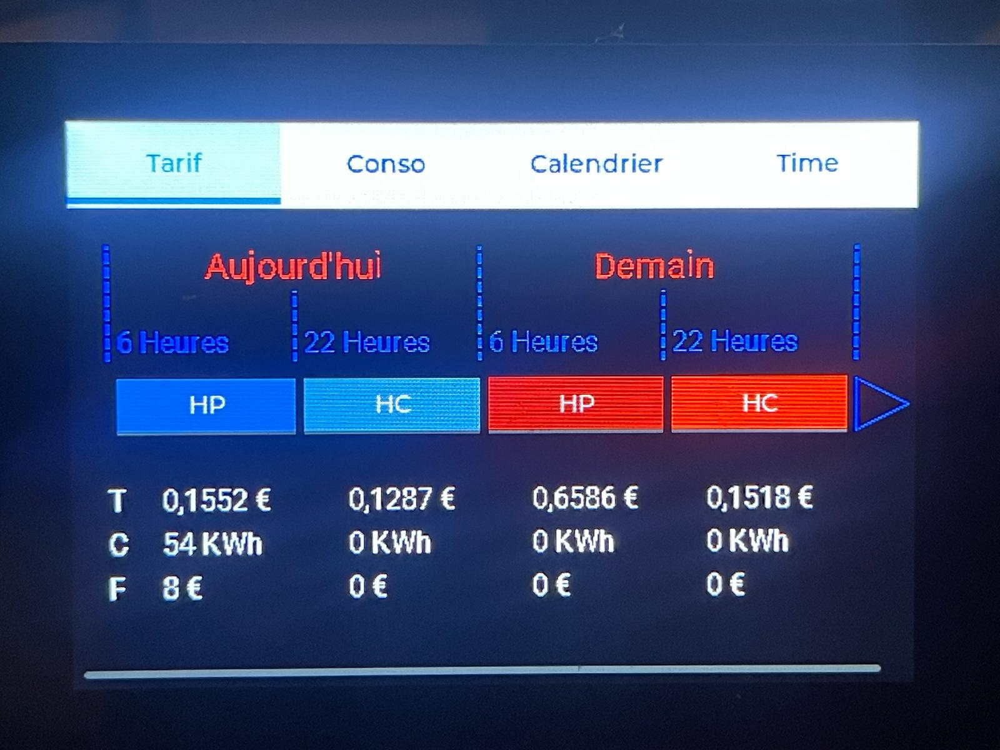

# tempoDisplay
An esphome script to display information about tempo day color
This is a WIP project, used since several week at home, but still need improvement.
It was first a WAF familly project to help my wife and children to understand the day color and price.

Tempo information is retrieve from rte service, so you will neeed to create an account, and get an api token.
Consumption information is retrieve from emoncms service, and will currently only work if you have it.
The service will certainly failed bad if it can access emoncms instance, and feed value and address are currenlty hardcode in the source.

This code is currently working on ESP32-S3 3.5 touch screen, JC3248W535C.
Display size is 320x480.
Certainly can be adapt to other display, but will need some reworking if not the same screen size.

